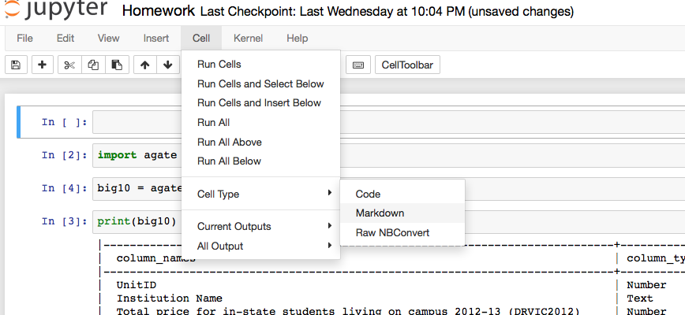

# Adding notes to your Jupyter Notebooks

One of the great features of Jupyter Notebooks is that in integrates working code with Markdown, a simple markup language for text. This document was made with Markdown. So was your syllabus. And most every other document in this class (even the lecture slides online are partially made with Markdown).

To do that, you need to either insert cells to your existing Notebook or just change the cell type for an empty cell. To insert a cell, go to Insert > Insert Cell Above or Insert Cell Below depending on what you need.

With a blank cell -- one you inserted or one that was there, it doesn't matter -- you need to change the type from Code to Markdown. You do that like this:

Then, in the blank Markdown cell, you add your notes. There's some simple formatting things you should know.

### Headlines

Markdown looks like:

    # h1
    ## h2
    ### h3
    #### h4
    ##### h5

Renders as:

# h1
## h2
### h3
#### h4
##### h5

### Emphasis

Markdown looks like:

    **Bold**
    *Italic*

Renders as:

**Bold**  
*Italic*  

If you want more than that, check out the [Markdown Here Cheatsheet](https://github.com/adam-p/markdown-here/wiki/Markdown-Here-Cheatsheet).
